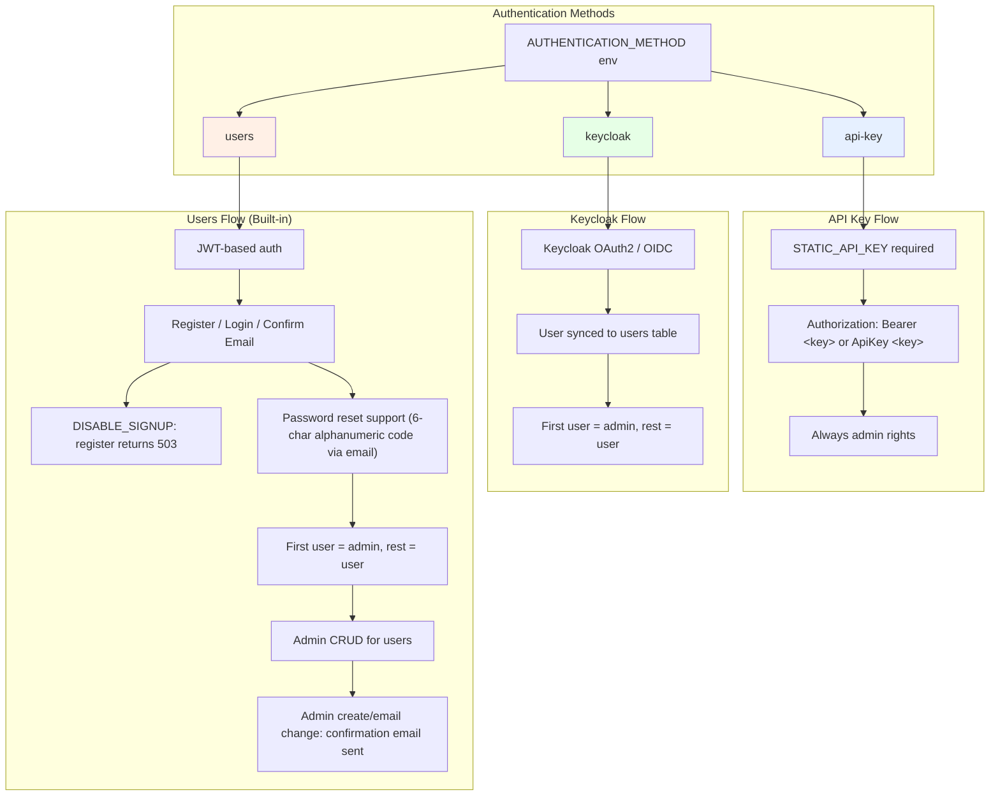
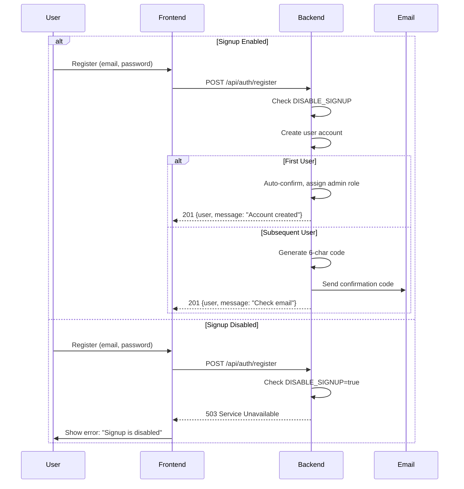

# Authentication

Authentication system supporting multiple authentication methods with configurable user registration.

## Overview

Agenstra supports three authentication methods:

- **API Key Authentication** - Static API key for simple authentication
- **Keycloak Authentication** - OAuth2/OIDC via Keycloak
- **Users Authentication** - Built-in user registration with JWT

Each method has different use cases and can be configured via environment variables.

## Authentication Methods

### API Key Authentication

Simple authentication using a static API key. Suitable for development and single-user deployments.

**Configuration**:

```bash
AUTHENTICATION_METHOD=api-key
STATIC_API_KEY=your-secure-api-key-here
```

**Features**:

- All requests require `Authorization: Bearer <key>` or `Authorization: ApiKey <key>` header
- API key authentication always grants admin rights
- No user management required
- Simple setup for development environments

### Keycloak Authentication

Enterprise-grade authentication using Keycloak OAuth2/OIDC. Suitable for organizations with existing identity management.

**Configuration**:

```bash
AUTHENTICATION_METHOD=keycloak
KEYCLOAK_AUTH_SERVER_URL=http://localhost:8380
KEYCLOAK_REALM=agenstra
KEYCLOAK_CLIENT_ID=agent-controller
KEYCLOAK_CLIENT_SECRET=your-client-secret
```

**Features**:

- OAuth2/OIDC authentication flow
- Users are synced to the users table
- First synced user gets admin role, subsequent users get user role
- Integration with existing identity providers
- Support for SSO and multi-factor authentication (via Keycloak)

### Users Authentication

Built-in user registration and authentication with JWT tokens. Suitable for standalone deployments without external identity providers.

**Configuration**:

```bash
AUTHENTICATION_METHOD=users
JWT_SECRET=your-jwt-secret-key
DISABLE_SIGNUP=false  # Set to true to disable self-registration
```

**Features**:

- User registration with email/password
- Email confirmation with 6-character alphanumeric codes
- Password reset functionality
- JWT-based authentication
- First registered user gets admin role
- Admin user management (CRUD operations)
- Optional signup disable for controlled onboarding

## Users Authentication Flow

### Registration

1. User registers with email and password
2. System checks if signup is enabled (`DISABLE_SIGNUP` environment variable)
3. If signup is disabled, registration returns 503 Service Unavailable
4. If enabled, user account is created:
   - First user: Auto-confirmed and assigned admin role
   - Subsequent users: Receive 6-character alphanumeric confirmation code via email

### Email Confirmation

1. User receives confirmation code via email (6-character alphanumeric: uppercase letters and numbers)
2. User enters email and code on confirmation page
3. System validates code and confirms email
4. User can now log in

### Login

1. User enters email and password
2. System validates credentials
3. System checks if email is confirmed
4. If valid, JWT token is issued
5. Token is stored in localStorage and included in subsequent requests

### Password Reset

1. User requests password reset with email
2. System sends 6-character alphanumeric reset code via email
3. User enters email, code, and new password
4. System validates code and updates password
5. User can log in with new password

## Disabling Signup

When `DISABLE_SIGNUP=true` is set:

### Backend Behavior

- `POST /api/auth/register` endpoint returns `503 Service Unavailable` with message "Signup is disabled"
- Self-registration is completely disabled
- Admin user creation via `POST /api/users` remains available for onboarding

### Frontend Behavior

- "Create an account" link is hidden on the login page
- Direct navigation to `/register` redirects to `/login`
- Users must be created by administrators

### Configuration

**Backend**:

```bash
DISABLE_SIGNUP=true
```

**Frontend** (via CONFIG JSON):

```json
{
  "authentication": {
    "type": "users",
    "disableSignup": true
  }
}
```

The frontend configuration should match the backend `DISABLE_SIGNUP` setting to ensure consistent behavior.

## User Roles

### Admin Role

- Full access to all features
- User management (create, read, update, delete users)
- Can create users via `POST /api/users`
- First user in the system automatically gets admin role

### User Role

- Standard user access
- Cannot manage other users
- Can change own password
- Can update own profile

## Admin User Management

Admins can manage users via the user management interface or API:

### Create User

- Admin creates user via `POST /api/users`
- Non-first users receive confirmation email
- User must confirm email before logging in

### Update User

- Admin can update user details
- Email changes require confirmation
- Password changes take effect immediately

### Delete User

- Admin can delete users
- Deletion removes all user data

## Security Features

### Password Security

- Passwords are hashed using bcrypt
- Minimum password length enforced
- Password confirmation required on registration

### Token Security

- JWT tokens expire after 7 days
- Tokens are stored securely in localStorage
- Tokens include user ID, email, and role

### Email Confirmation

- 6-character alphanumeric confirmation codes
- Codes expire after use
- Prevents unauthorized account creation

### Rate Limiting

- All endpoints are rate-limited
- Prevents brute force attacks
- Configurable limits per endpoint

## API Endpoints

### Authentication Endpoints (Public)

- `POST /api/auth/login` - Login with email/password
- `POST /api/auth/register` - Register new user (returns 503 when `DISABLE_SIGNUP=true`)
- `POST /api/auth/confirm-email` - Confirm email with 6-character code
- `POST /api/auth/request-password-reset` - Request password reset
- `POST /api/auth/reset-password` - Reset password with code
- `POST /api/auth/change-password` - Change password (authenticated)

### User Management Endpoints (Admin Only)

- `GET /api/users` - List users
- `POST /api/users` - Create user
- `GET /api/users/:id` - Get user
- `POST /api/users/:id` - Update user
- `DELETE /api/users/:id` - Delete user

## Authentication Flow Diagram



## Registration Sequence Diagram



## Per-Client Permissions

When using **keycloak** or **users** authentication, access to clients is controlled by per-client permissions. Users can be assigned to clients with roles (admin/user). In **api-key** mode, users do not play a role and all permission checks are bypassed.

See **[Client Management](./client-management.md#per-client-permissions)** for details on access control rules and managing client users.

## Related Documentation

- **[Environment Configuration](../deployment/environment-configuration.md)** - Environment variable reference
- **[Client Management](./client-management.md)** - Per-client permissions and user management
- **[Backend Agent Controller Application](../applications/backend-agent-controller.md)** - Backend authentication implementation
- **[Frontend Agent Console Application](../applications/frontend-agent-console.md)** - Frontend authentication UI

---

_For detailed API specifications, see the application and API reference docs linked below._
