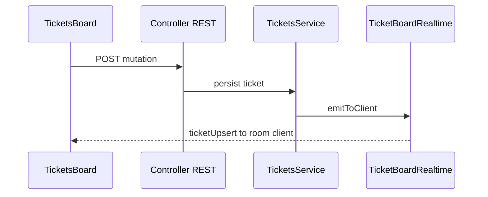

# Tickets and Workspaces

Project tickets are workspace-scoped work items stored on the **agent controller**. They support planning, collaboration, optional AI-assisted body generation, workspace migration, and ticket automation with observable runs.

## Overview

- **Workspace** – In the API and realtime model, a ticket belongs to a **client** (remote agent-manager instance). The console surfaces this as a workspace when you work with tickets for that client.
- **REST** – List, create, read, update, and delete tickets; add comments; read activity; migrate a ticket subtree to another workspace; configure automation; approve or unapprove automation; list runs, inspect a run, and cancel a run. Optional flows include prototype prompts, body-generation sessions, and applying generated bodies (see OpenAPI for request shapes).
- **Realtime** – After mutations, the board stays coherent via Socket.IO on the **`tickets`** namespace (same TCP port as the `clients` namespace by default). REST remains the source of truth for full loads and pagination.

## Features

- **Board and filters** – List tickets by workspace (`clientId`), status, or parent (including root-only lists).
- **Collaboration** – Comments and an activity trail per ticket.
- **Migration** – Move a resolved root ticket and its descendants to another workspace (`targetClientId`); realtime emits removals on the source room and upserts on the target room.
- **Automation** – Configure per-ticket automation, approve or revoke approval, start and inspect runs, cancel in-flight runs. See [Ticket automation](./ticket-automation.md). The chat UI can also receive controller-originated automation snapshots on the **`clients`** namespace (see AsyncAPI).
- **Chat integration** – Without joining `tickets`, chat clients on **`clients`** can still receive `ticketChatTicketUpsert` for ticket metadata updates broadcast to room `client:{clientId}`.

## Architecture

### REST and workspace access

Tickets are authorized like other controller resources: you only see workspaces you can access (global admin, client creator, or `client_users` membership unless using API-key mode). Some automation and configuration operations require **workspace management** rights; failed checks return `403` (see OpenAPI operation descriptions).

### Realtime: tickets namespace

After `setClient` on namespace **`tickets`**, the socket joins room `client:{clientId}`. Typical server events include:

- `ticketUpsert` – Full ticket row after create or update
- `ticketRemoved` – Deleted or removed from a workspace (e.g. after migrate)
- `ticketCommentCreated`, `ticketActivityCreated`
- `ticketAutomationUpsert`, `ticketAutomationRunUpsert`, `ticketAutomationRunStepAppended`

## Console entry points

- Routes **`/tickets`** and **`/tickets/:clientId`** (authenticated; active client context required). See [Frontend Agent Console](../applications/frontend-agent-console.md).

## Related documentation

- **[Ticket automation](./ticket-automation.md)** – Autonomous run scheduler and lifecycle
- **[WebSocket Communication](./websocket-communication.md)** – `clients` and `tickets` namespaces
- **[Backend Agent Controller](../applications/backend-agent-controller.md)** – HTTP and WebSocket surface
- **[Authentication](./authentication.md)** – Access modes and roles

## API and protocol references

- **HTTP**: [Agent Controller OpenAPI](/spec/agent-controller/openapi.yaml) – paths under `/tickets`, `/tickets/{id}`, automation and migration subpaths
- **WebSocket**: [Agent Controller AsyncAPI](/spec/agent-controller/asyncapi.yaml) – channels `tickets/*` and related `clients/*` ticket automation events

---

_For field-level schemas and status enums, use the OpenAPI specification linked above._
